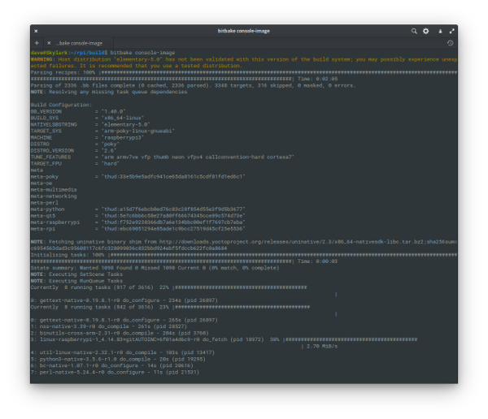

# yocto-pi-build

A BASH script for automaating steps of downloading, configuring and running a Yocto 
build for the Raspberry Pi. Based around the steps outlined at 
[JumpNowTek](https://jumpnowtek.com/rpi/Raspberry-Pi-Systems-with_Yocto.html).

## Screeenshot



## Requirements

A Debian or Ubuntu based Linux system where the default shell has been set to
BASH (n.b., the default on these systems is normally DASH). To ensure BASH has
been set:

```
 $ sudo dpkg-reconfigure dash
```

Select No. Otherwise, yocto-pi-build.sh will exit with a warning message if launched 
in the context of any other shell.

## Contents

* install-yocto-prerequisites.sh: Verifies that prerequisite packages are present 
and will install them if found to be absent.
* yocto-pi-build.sh: Checks shell is set to BASH, downloads Yocto contents, configures 
and executes specified build target (see below).

# Usage

```
$ ./install-yocto-prerequisites.sh TARGET
```

Where TARGET is one of:

* ap-image
* audio-image
* console-basic-image
* console-image
* flask-image
* gumsense-image
* iot-image
* py3qt-image
* qt5-basic-image
* qt5-image


